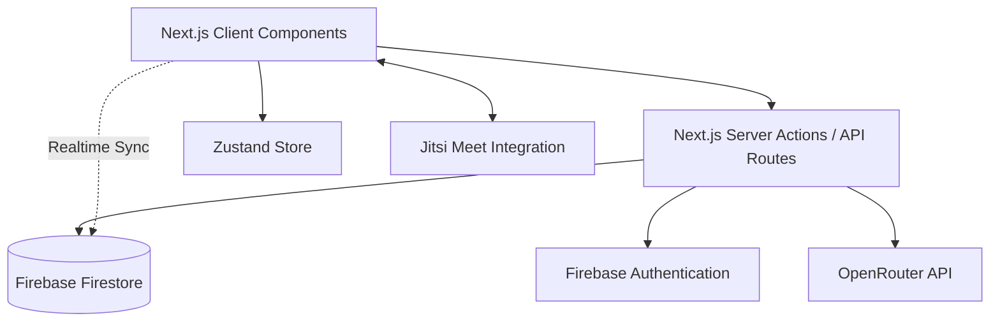

# SkillBridge: Complete Project Overview & Architecture

## 1. Project Introduction
SkillBridge is a modern, peer-to-peer AI learning platform designed to bridge the gap between doubts and mastery for college students. It combines a vibrant peer-to-peer discussion feed with advanced AI tutoring and integrated mentorship, wrapped in a highly engaging, gamified user experience. The platform is built to provide immediate assistance via AI and fall back to peer/expert support when needed.

## 2. Technical Stack
SkillBridge leverages a cutting-edge front-end and a responsive serverless back-end.

*   **Framework**: Next.js 14+ (App Router)
*   **Language**: TypeScript (Strict mode)
*   **Database & Backend (BaaS)**: Firebase (Firestore for NoSQL DB, Authentication, Storage)
*   **AI Engine**: OpenRouter API (Leveraging models like Gemini 2.0 Flash / Pro)
*   **UI & State**: React 19, Zustand (for global state)
*   **Animations & Styling**: Framer Motion, Vanilla CSS (Modern Glassmorphism), Tailwind CSS v4, Shadcn/Radix UI components.
*   **Real-time Communication**: Jitsi Meet (WebRTC for video calling), Firestore (Real-time syncing for chat)
*   **Deployment**: Vercel (Edge network, CI/CD)

## 3. High-Level Architecture
The architecture follows a modular, feature-oriented design within a Next.js Monolithic structure:

*   **Domain-Driven Structure**: The codebase (`src/features/`) is organized by domain (Auth, Doubts, Mentors, Productivity, Gamification), ensuring encapsulation of UI, state, and API logic.
*   **Client/Server Split**: Next.js Server Components are used for fast initial loads and SEO, while Client Components (`"use client"`) handle interactive elements (animations, WebRTC, rich text editing).
*   **Real-time Layer**: Firestore's snapshot listeners provide instant updates for chat messages, doubt resolutions, and notification delivery without manual refreshing.

## 4. Core Features & Technology Usage

### A. Smart Doubt Resolution
**Purpose**: Provide instant answers to student questions, falling back to community help.
**Process**:
1.  User posts a doubt with tags and subject.
2.  **Next.js Server Route** sends the doubt to **OpenRouter API** for an immediate, structured response (AI First-Response).
3.  If the AI answer isn't sufficient, the doubt enters the **Global Peer Feed**.
4.  Peers provide answers using a **Tiptap Rich Text Editor**.
5.  Authors can mark an answer as "Accepted".
**Technologies Used**: OpenRouter (AI), Tiptap (Rich Text), Firestore (Storage & Real-time voting).

### B. AI Productivity & Study Module
**Purpose**: Analyze user activity to create custom study plans and track progress.
**Process**:
1.  The system aggregates recent activity (recent doubts, test scores, mentor sessions) from Firestore.
2.  This context is passed to the **OpenRouter API** to generate a 24-hour custom study plan.
3.  Users can add tasks manually or "Quick Add" tasks derived from AI suggestions.
4.  Task completion states are synced to **Firestore** and update global user metrics.
**Technologies Used**: OpenRouter API (Analysis), Zustand (Local Task State), Tailwind (Progress visualizations).

### C. Expert Mentorship & Real-Time Communication
**Purpose**: Allow direct consultations and live tutoring sessions.
**Process**:
1.  Users with high reputation can upgrade to "Mentor" status.
2.  Mentors define availability slots in **Firestore**.
3.  Students book slots (handled via Next.js backend for conflict resolution).
4.  At the booked time, a **Real-time Chat** interface opens (Firestore Snapshot Listeners).
5.  A **"Join Call"** button mounts the **Jitsi Meet iframe API** for seamless in-app WebRTC video calling.
**Technologies Used**: Jitsi Meet WebRTC, Firestore (Chat & Booking schema), Date-fns (Time parsing).

### D. Gamification Engine & Reputation
**Purpose**: Motivate users to participate, answer questions, and study regularly.
**Process**:
1.  Key actions (asking/answering doubts, completing tasks) trigger **Server Actions**.
2.  The server updates the user's `reputation` score in Firebase.
3.  A secondary process checks if the new score crosses a threshold to unlock a **Badge** (e.g., "Novice Solver").
4.  If a badge is unlocked, a notification is dispatched, triggering a **Framer Motion** "Unlock Ceremony" animation on the client.
**Technologies Used**: Firestore Rules (Security for reputation), Framer Motion (Animations), Next.js Server Actions (Secure score calculation).

## 5. Security & Data Flow
*   **Authentication**: Handled entirely through Firebase Auth. Protected routes in Next.js redirect unauthenticated users to the login flow.
*   **Database Security**: Firestore Security Rules (`firestore.rules`) are strictly defined. Users can only edit their own profile/tasks, but can read global doubts.
*   **API Security**: Calls to OpenRouter are routed through Next.js API Routes (`/api/ai/*`) so that API keys are never exposed to the client bundle.

## 6. Summary
SkillBridge elegantly combines the speed of modern web frameworks (Next.js), the real-time capabilities of Firebase, and the intelligence of OpenRouter AI. By isolating features into discrete modules, the project maintains scalability while delivering a rich, highly interactive, and gamified educational experience.
