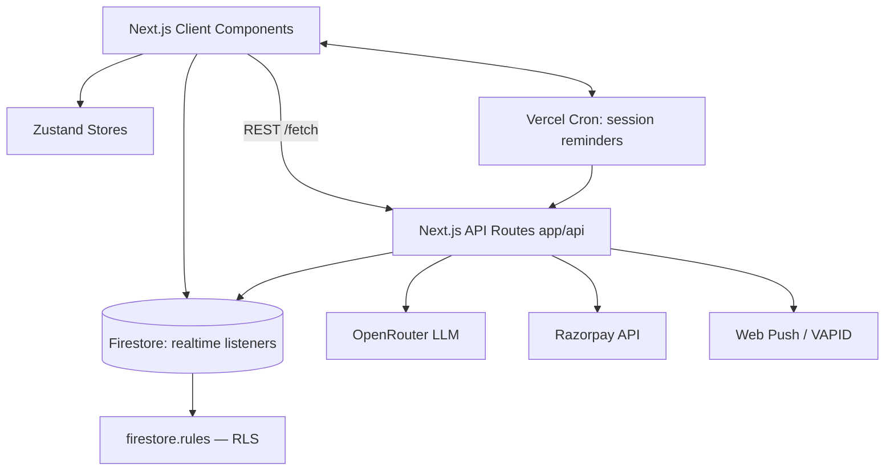

# SkillBridge — System Architecture

> Authoritative reference for how the codebase is organised, how data flows through
> the system, and why each module exists. Keep this in sync when you add features.

## 1. Overview

SkillBridge is a **peer-to-peer AI learning platform** for college students. A student can:

1. Ask a doubt → an **AI first-response** answers instantly (structured explanation).
2. If that is not enough, the doubt is published to a **global peer feed** for community answers.
3. Book **1:1 mentor sessions** (Razorpay checkout, race-condition-safe slots, post-session ratings).
4. Track **studies/productivity** — an AI coach generates a 24h plan from real activity.
5. Earn **reputation points / badges** and climb **leaderboards**.
6. (Admin) Moderate content and approve/ reject **mentor applications**.

## 2. Tech Stack

| Layer            | Technology                                                              |
|------------------|-------------------------------------------------------------------------|
| Framework        | **Next.js 16** (App Router, React 19, TypeScript strict)                |
| UI               | Tailwind CSS v4 (`tw-animate-css`), shadcn-style components on **Base UI**, lucide-react icons |
| State            | Zustand (auth + app stores)                                             |
| Backend / DB     | Firebase — **Firestore** (data, **region: asia-south1/Mumbai**), **Authentication**, Storage |
| AI Engine        | **OpenRouter** (`openrouter/free`) called from server-side API routes   |
| Rich Text        | TipTap (doubt/answer editor)                                            |
| Animations       | Framer Motion                                                            |
| Diagrams         | Mermaid.js (AI-generated concept diagrams)                               |
| Payments         | Razorpay (server-side orders + signature verification)                   |
| Push             | Web Push (service worker) + Firestore in-app notifications + Vercel cron |
| Deployment       | **Vercel** (server routes + crons, root dir = `frontend/` via root `vercel.json` `rootDirectory`). Firestore rules/indexes via Firebase CLI |
| Repo layout      | Monorepo: `frontend/` (Next.js app) + `backend/` (Firebase config, seeds) |

## 3. High-Level Architecture



* **Server Components** → fast initial paint / SEO (root page, simple pages).
* **Client Components** (`"use client"`) → interactivity: rich text, video calls, realtime lists.
* **API routes** (`frontend/src/app/api/**/route.ts`) → all privileged operations that must keep
  secrets (OpenRouter/Razorpay/VAPID) off the client bundle. These are the **BFF** layer.
* **Feature modules** (`frontend/src/features/<domain>/`) encapsulate domain types + Firestore access
  + domain components. **No cross-feature imports** other than through `notifications/utils`.

## 4. Directory Map

All paths below are relative to the **repo root** — the app source lives under `frontend/`.

```bash
.
├── frontend/                   # Next.js 16 app — the deployable unit on Vercel
│   ├── src/
│   │   ├── app/                # Next.js routes (App Router) — "app layer"
│   │   │   ├── layout.tsx      #   root layout: fonts, AuthProvider, Toaster
│   │   │   ├── page.tsx        #   / → redirect to /login
│   │   │   ├── (auth)/         #   public auth: /login, /register
│   │   │   ├── (app)/          #   authenticated shell (Auth gate + onboarding redirect)
│   │   │   │   ├── layout.tsx  #     auth guard, daily-login, push subscription, AppShell
│   │   │   │   └── <route>/    #     feed, ask, mentors, sessions, mentor-slots, tests,
│   │   │   │                   #     productivity, messages, call, leaderboard,
│   │   │   │                   #     notifications, profile, settings, admin, seed, onboarding
│   │   │   └── api/            #   server-only BFF routes (see §6)
│   │   ├── components/
│   │   │   ├── layout/         #   AppShell, Sidebar, TopHeader, MobileNav
│   │   │   ├── shared/         #   LoadingSkeleton, PageTransition
│   │   │   └── ui/             #   shadcn/Base-UI primitives + RichTextEditor, AwardBadgeToast
│   │   ├── features/           #   domain-driven modules (see §5)
│   │   ├── lib/                #   cross-cutting utilities & integrations
│   │   │   ├── firebase/config.ts   #   Firebase client init (singleton)
│   │   │   ├── ai/productivityCoach.ts
│   │   │   ├── razorpay/client.ts
│   │   │   └── badges.ts / utils.ts
│   │   ├── store/useAppStore.ts     #   UI prefs (theme, sidebar)
│   │   └── styles/                  #   globals.css + design tokens
│   ├── public/sw.js            # push-notification service worker (/sw.js)
│   ├── vercel.json             # cron schedule: /api/cron/session-reminders
│   └── next.config.ts / tsconfig.json / postcss.config.mjs / eslint.config.mjs
├── backend/                    # Firebase server-side config + CLI tooling (not deployed)
│   ├── config/                 #   firebase.json, .firebaserc, firestore.rules, firestore.indexes.json
│   ├── scripts/                #   seed.ts (demo), seed/seedMentorData.ts (admin/emulator),
│   │                           #   gen-vapid.cjs, tsconfig.seed.json
│   ├── package.json            #   backend deps (tsx, firebase-admin, firebase) + seed scripts
│   └── README.md               #   Firestore data model + "what lives in which region" map
├── docs/ARCHITECTURE.md        # this file
├── README.md                   # monorepo index
└── PROJECT_OVERVIEW.md         # product overview
```

## 5. Feature Modules

| Module          | Owns                                                        | Notable entry points |
|-----------------|-------------------------------------------------------------|----------------------|
| `auth`          | Firebase auth state, profile provisioning, useAuth()        | `store.ts`, `components/AuthProvider.tsx`, `hooks/useAuth.ts` |
| `doubts`        | Doubt feed CRUD, atomic voting, answers, AI explanation UI  | `api/doubts.ts`, `api/answers.ts`, `components/*` |
| `mentors`       | Mentor profiles, slot CRUD, **transactional booking**, post-session rating, admin approvals, **recommendation engine** | `api.ts`, `recommendation/*` |
| `tests`         | Practice tests + attempts                                    | `api.ts` |
| `productivity`  | Task CRUD, AI study-plan UI, activity-context aggregation    | `api.ts`, `components/*` |
| `messages`      | Direct chat with mentors (Firestore realtime)                | `api.ts` |
| `notifications` | In-app notification dispatch + web-push subscription          | `utils.ts`, `hooks/usePushSubscription.ts` |
| `reputation`    | Points ledger, badge awarding, daily login/streaks, leaderboard | `api.ts`, `components/BadgeManager.tsx` |
| `admin`         | Platform analytics, role assignment, doubt moderation         | `api.ts` |

**Client/Server firebreak:** `features/*` run on the client and talk to Firestore directly
(protected by `firestore.rules`). Anything that needs a secret (AI keys, Razorpay secret,
VAPID private key, cron auth) goes through `src/app/api/*`.

## 6. API Routes (server-side)

| Route                                   | Method | Purpose                                          | Secret |
|-----------------------------------------|--------|--------------------------------------------------|--------|
| `/api/ai/doubt`                         | POST   | AI first-response for a doubt (structured JSON)  | OPENROUTER_API_KEY |
| `/api/ai/diagram`                       | POST   | Mermaid diagram for a doubt                      | OPENROUTER_API_KEY |
| `/api/ai/generate-test`                 | POST   | AI-generated MCQ test                            | OPENROUTER_API_KEY |
| `/api/ai/suggest-tags`                  | POST   | Suggest doubt tags                               | OPENROUTER_API_KEY |
| `/api/productivity/generate`            | POST   | AI 24h study plan from user context              | OPENROUTER_API_KEY |
| `/api/razorpay/create-order`            | POST   | Create Razorpay order for slot booking           | RAZORPAY_KEY_* |
| `/api/razorpay/verify`                  | POST   | Verify payment signature                         | RAZORPAY_KEY_* |
| `/api/notifications/send`               | POST   | Write in-app notification + try web push          | VAPID_* |
| `/api/cron/session-reminders`           | GET    | Vercel cron: near-start session reminders (idempotent flags) | CRON_SECRET |

## 7. Firestore Data Model

> **Region:** every collection below lives in the Firestore `(default)` database located in
> **`asia-south1` (Mumbai)** — set in `backend/config/firebase.json`
> (`firestore.location`). Per-collection breakdown → see [`backend/README.md`](../backend/README.md).

Collection paths used across the app:

| Collection                 | Purpose                                                        |
|----------------------------|----------------------------------------------------------------|
| `users/{uid}`              | User profile: role, reputation, streak, badges, counts, budgetCeiling |
| `mentors/{userId}`         | Mentor profile: subjects, expertise, fee, ratings, `mentorApproved` |
| `mentorSlots/{slotId}`     | Availability slot: start/end, fee, `isBooked`, meetingLink    |
| `bookings/{bookingId}`     | Session booking: slot/mentor/student, Razorpay ids, status, `ratingSubmitted`, reminder flags |
| `mentorRatings/{id}`       | Post-session rating docs (1–5 + comment)                      |
| `doubts/{doubtId}`         | Doubt posts: votes, responsesCount, isResolved                |
| `answers/{answerId}`       | Answers: `doubtId`, isAccepted, content (TipTap HTML)          |
| `votes/{userId_doubtId}`   | One vote per user per doubt (idempotency key)                 |
| `notifications/{id}`       | In-app notifications per user                                  |
| `users/{uid}/pushSubscriptions/main` | Web-push subscription (single doc per user)          |
| `tasks/{taskId}`           | Study-plan tasks                                               |
| `aiProductivityLogs/{id}`  | Persisted AI study plans                                       |
| `tests/{testId}`           | Generated / manual practice tests (`createdByAI`)              |
| `testAttempts/{attemptId}` | Test result attempts (drive weak-topic detection)              |
| `conversations/{id}` + `.../messages` | Mentor–student chat                                   |
| `reputationEvents/{id}`    | Points ledger (dedupe key = userId+type+refId)                |
| `mentorRecommendationShadowLogs/{id}` | Recommendation audits (see §9)                   |

Index dependencies: `firestore.indexes.json` declares the composite indexes used by
ordered/where queries (answers by doubt, attempts by user, bookings by student, etc.).

## 8. Key Data Flows

### AI-first doubt resolution
```
Student → /ask (TipTap) → createDoubt()
   │  (optional) AIExplanationDisplay ← /api/ai/doubt (OpenRouter JSON)
Feed (/feed) ← subscribeToDoubts()  → peers answer via answers.api
Author accepts answer  → answers/answers.ts acceptAnswer() → doubt resolved + answerer awarded
```

### Race-condition-safe mentor booking
`bookSlotTransaction()` (`features/mentors/api.ts`) wraps **read slot + write booking +
flag slot** in a Firestore `runTransaction`:
- throws `SLOT_ALREADY_BOOKED` / `SLOT_NOT_FOUND` on conflict
- booking id is pre-allocated so it can be returned from inside the transaction

### Post-session rating
`submitMentorRating()` runs a transaction that:
1. rejects if booking already `ratingSubmitted` (idempotent)
2. recomputes the mentor's rolling `averageRating` + `totalRatings`
3. flips `ratingSubmitted = true`, then writes `mentorRatings/` outside the txn.

### Notifications
- In-app: `notifications/utils.ts` → `POST /api/notifications/send` writes Firestore doc.
- Web push: same route looks up the user's `pushSubscriptions/main`, sends VAPID push.
- Reminders: Vercel cron (`0 0 * * *`) hits `/api/cron/session-reminders` (bearer
  `CRON_SECRET`); **at-most-once** via atomic `reminderSent30min/reminderSent5min` flags.

### Smart Mentor Recommendation (heuristic, not ML)
`features/mentors/recommendation/` — deterministic scorer (pure functions):
`Topic Match 40 + Rating 25 + Availability 20 + Novelty 10 + Budget 5 = /100`.
- Runs in **shadow mode** by default (`NEXT_PUBLIC_RECOMMENDATION_SHADOW_MODE`), logging
  every decision to `mentorRecommendationShadowLogs` for offline validation.
- Flip the env var to `"false"` to expose ranked results in the `/mentors` UI.

## 9. Auth & Route Guarding

- `AuthProvider` subscribes to `onAuthStateChanged` → `auth/store.ts`.
- `(app)/layout.tsx` is the gate: unauthenticated → `/login?redirect=…`; incomplete profile
  → `/onboarding`; on login it fires `processDailyLogin()` (streaks) once per session and
  registers the push subscription.
- Firestore rules in `firestore.rules` enforce ownership & admin checks server-side.

## 10. Environment Variables

See `.env.example` for the full list:

| Variable                              | Where used                                    |
|---------------------------------------|-----------------------------------------------|
| `NEXT_PUBLIC_FIREBASE_*`              | client Firebase init (`lib/firebase/config.ts`) |
| `OPENROUTER_API_KEY`                  | all `app/api/ai/*` + productivity routes       |
| `RAZORPAY_KEY_ID` / `RAZORPAY_KEY_SECRET` | server-side order/verify                  |
| `NEXT_PUBLIC_RAZORPAY_KEY_ID`         | client checkout.js                            |
| `VAPID_EMAIL` / `NEXT_PUBLIC_VAPID_PUBLIC_KEY` / `VAPID_PRIVATE_KEY` | web push |
| `NEXT_PUBLIC_APP_URL`                 | cron → notification base URL (defaults to vercel URL) |
| `CRON_SECRET`                         | bearer token for `/api/cron/session-reminders` |
| `NEXT_PUBLIC_RECOMMENDATION_SHADOW_MODE` | `"false"` enables ranked mentor UI |

## 11. Development & Seeding

- **Run:** `cd frontend && npm run dev` (see `frontend/.env.local` for keys).
- **Demo data in-app:** log in and open **`/seed`** → creates demo student/mentor/admin
  accounts, mock mentors, and mock doubts.
- **Recommendation test data (emulator):** `cd backend && npm run seed:mentors` →
  `backend/scripts/seed/seedMentorData.ts` (Admin SDK; emulator-guarded, see file header).
- **Legacy CLI seed:** `cd backend && npm run seed` → `backend/scripts/seed.ts`
  (seeds mentors + conversations; needs `NEXT_PUBLIC_FIREBASE_*` env vars).
- **Secrets:** VAPID keypair generation → `cd backend && npm run vapid:generate`.
- **Build:** `cd frontend && npm run build` (Vercel runs this automatically inside
  `frontend/` because the repo-root [`vercel.json`](../vercel.json) sets
  `rootDirectory: "frontend"` — no dashboard setting needed).

## 12. Conventions

- Feature modules own their types, data access, and components — keep it that way.
- Client code must never assume secrets; go through `/api/*`.
- Realtime lists use Firestore `onSnapshot`; prefer `subscribe*()` helpers in feature APIs.
- Server-unsafe operations (voting, booking, rating, reminders) use `runTransaction`.
- Notification dispatch is always fire-and-forget via `notifications/utils`.